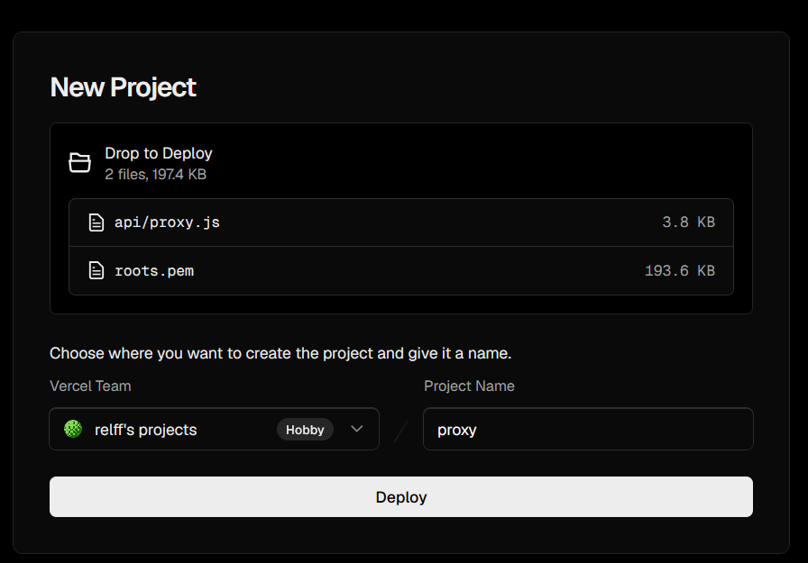
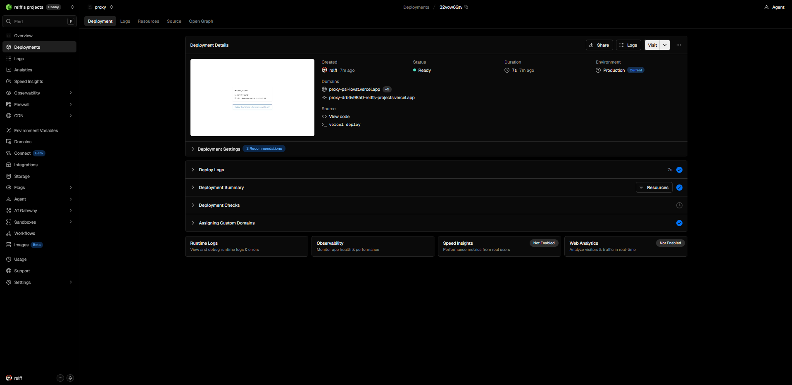
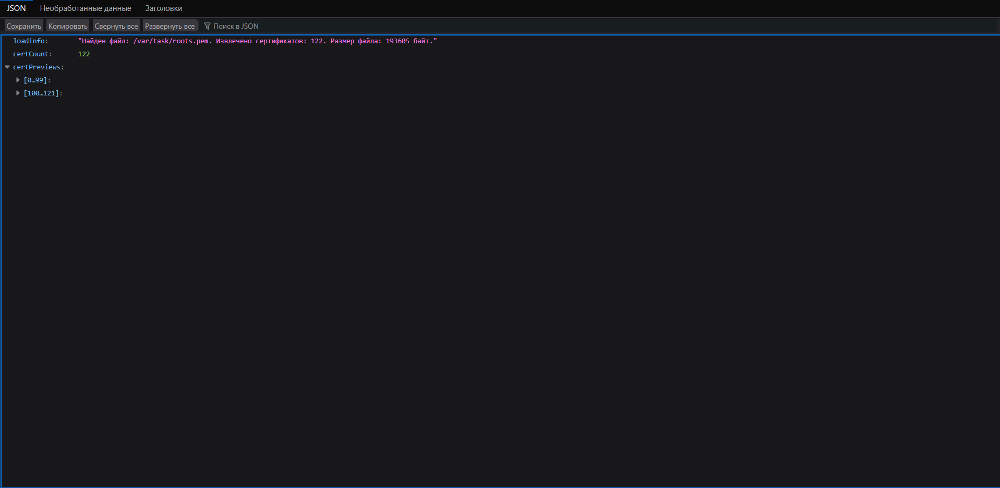
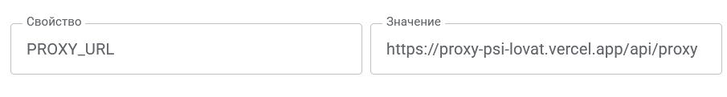

# Личный прокси для T-Invest API (на случай проблем с сертификатом)

## Когда это нужно

Только если синхронизация падает с ошибкой вида `Ошибка SSL` / `SSL Error`
при обращении к `invest-public-api.tbank.ru` **и**
`invest-public-api.tinkoff.ru` одновременно. Причина — переход Т-Банка на
TLS-сертификаты НУЦ Минцифры РФ (подтверждено официально: см.
`developer.tbank.ru/eacq/intro/certificates/migration-russian-trusted-ca`,
и подтверждено собственной поддержкой Т-Банка — обращение №3-570850,
«проблема с приложениями Google известна»). Google Apps Script не даёт
настроить доверенные сертификаты напрямую — поэтому обходной путь через
свой личный прокси.

Если прямое подключение у тебя работает — **этот раздел не нужен вообще**,
ничего настраивать не надо.

## Важно: это ЛИЧНЫЙ прокси, не общий

Разворачивается на **твоём собственном** аккаунте Vercel — не используй
чужой готовый прокси.
Токен и данные портфеля будут идти через эту инфраструктуру — она должна
быть под твоим контролем.

**Почему это безопасно, если сделать честно:** проверка SSL-сертификата
в коде прокси остаётся **полностью включённой**. Мы не отключаем защиту
(в отличие от быстрого, но небезопасного варианта с
`rejectUnauthorized: false`) — просто расширяем список удостоверяющих
центров, которым доверяем, добавив в него ещё и Минцифру, рядом со всеми
обычными мировыми CA. Если кто-то попробует подменить сервер поддельным
сертификатом — запрос всё так же будет отклонён.

---

## Шаг 1 — Файл с доверенными сертификатами (roots.pem)

Файл `roots.pem` уже лежит готовым в папке `proxy/` этого репозитория —
собирать его самостоятельно не нужно, просто используй как есть.

**Из чего он состоит** (на случай, если интересно, что внутри, или
захочешь пересобрать свежую версию в будущем):
- **Стандартный публичный список сертификатов** —
  [`cacert.pem`](https://curl.se/ca/cacert.pem) с curl.se, тот же
  бандл, которым пользуется весь мир по умолчанию
- **Корневой и промежуточный сертификаты НУЦ Минцифры РФ** — официально
  с [`gosuslugi.ru/crt`](https://www.gosuslugi.ru/crt) (раздел
  «Сертификаты для Windows»), просто дописаны в конец того же файла

Ничего секретного внутри нет — это открытые сертификаты, публично
доступные с обоих источников, файл безопасно хранить прямо в репозитории.

Если когда-нибудь понадобится обновить (например, у Минцифры выпустят
новый корневой сертификат) — принцип тот же: скачать оба файла заново,
приклеить в конец `cacert.pem` (Windows: `copy /b cacert.pem+root.pem+
sub.pem roots.pem`, Mac/Linux: `cat cacert.pem root.pem sub.pem >
roots.pem`) и заменить файл в репозитории.

## Шаг 2 — Разверни прокси на Vercel

1. Собери на компьютере папку `proxy` со структурой:
   ```
   proxy/
   ├── api/
   │   └── proxy.js   ← файл рядом с этой инструкцией
   └── roots.pem      ← уже в репозитории, ничего собирать не нужно
   ```

2. Зарегистрируйся/зайди на [vercel.com](https://vercel.com) (бесплатный
   тариф, «Hobby» плана достаточно)

3. На главной странице — область «Deploy your first project» с
   подписью «drop a file, **folder**, or .zip to deploy». Перетащи туда
   папку `proxy` целиком (не отдельные файлы, а именно папку).

   

4. Vercel сам распознает структуру, предложит имя проекта (можно
   оставить `proxy`) — жми **Deploy**

5. Через 1-2 минуты получишь готовый адрес вида
   `https://proxy-твой-код.vercel.app`

   

### Проверка, что прокси сам по себе работает

Открой в браузере: `https://твой-адрес.vercel.app/api/proxy?debug=1`

Должен вернуться JSON вида:
```json
{
  "loadInfo": "Найден файл: ... Извлечено сертификатов: 122. ...",
  "certCount": 122,
  "certPreviews": [...]
}
```
Если `certCount` — 0 или ошибка «не нашёл файл» — значит `roots.pem`
не попал в деплой или лежит не там, где ожидает код (см. раздел
«Если не работает» ниже).



## Шаг 3 — Подключи прокси к трекеру

1. В таблице: **Расширения → Apps Script → ⚙️ Настройки проекта →
   Свойства скрипта**
2. Добавь свойство: имя `PROXY_URL`, значение — твой адрес **с
   хвостом `/api/proxy`**, например:
   ```
   https://proxy-твой-код.vercel.app/api/proxy
   ```
   (без этого хвоста получишь `PROXY 404` — прокси есть, но по адресу
   без указания конкретной функции ничего не отвечает)

   

3. Больше ничего менять не нужно — `tiFetch_` в `tinvest.js` сам
   подключит прокси как третий, резервный уровень: сначала пробует
   `tbank.ru` напрямую, потом `tinkoff.ru`, и только если оба не
   сработали — идёт через твой прокси

4. Запусти `Tinkoff → 🔄 Синхронизировать позиции` — должно пройти
   без ошибок, просто чуть медленнее обычного (лишний шаг через прокси)

---

## Если не работает

**Ошибка про сертификат (`self-signed certificate` и т.п.)** — значит
`roots.pem` не подхватился или собран неверно. Открой
`.../api/proxy?debug=1` (см. выше) и проверь `certCount` — если 0 или
файл не найден, пересобери `roots.pem` заново (шаг 1), убедись, что
итоговый файл лежит рядом с `api/`, как в структуре из шага 2.

**`PROXY 404`** — почти всегда означает, что в `PROXY_URL` не хватает
`/api/proxy` на конце адреса.

**Ошибка изменилась на код от 400 до 499, но не 404** — это уже не
проблема прокси, а реальный ответ от самого Т-Банка (например, неверный
токен) — прокси в этом случае работает правильно, разбираться нужно
уже не с сертификатом.

## Почему не проще — просто `rejectUnauthorized: false`?

Потому что это отключает проверку сертификата **полностью**, а не
только «доверяет ещё и Минцифре». С таким флагом прокси примет вообще
любой сертификат, от кого угодно — в том числе и от того, кто попытается
подменить сервер между прокси и Т-Банком. Наш вариант решает ту же
задачу честно: проверка остаётся включённой всё время, просто список
доверенных центров стал на несколько пунктов длиннее.
