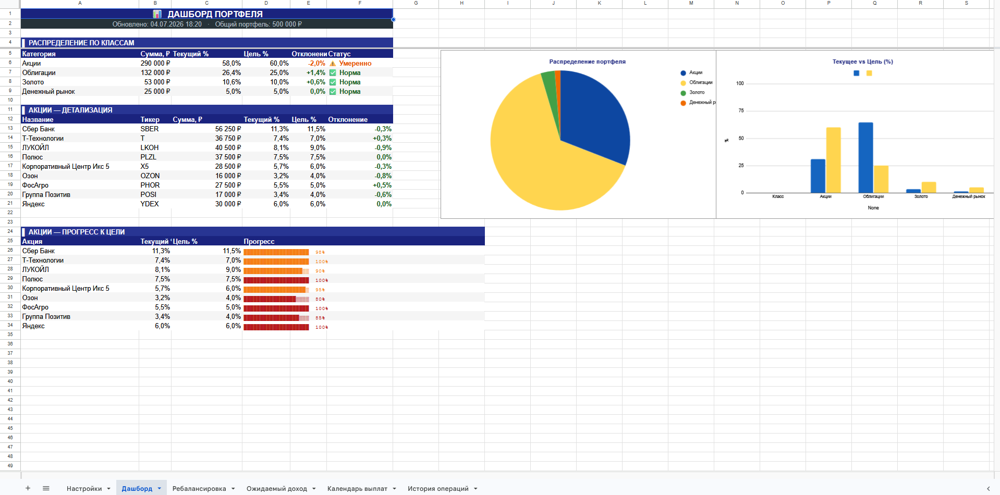
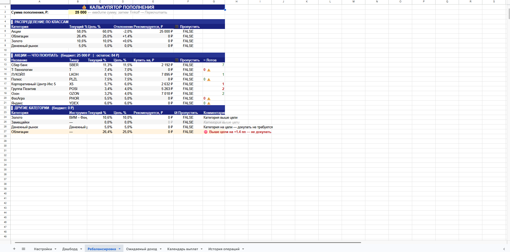
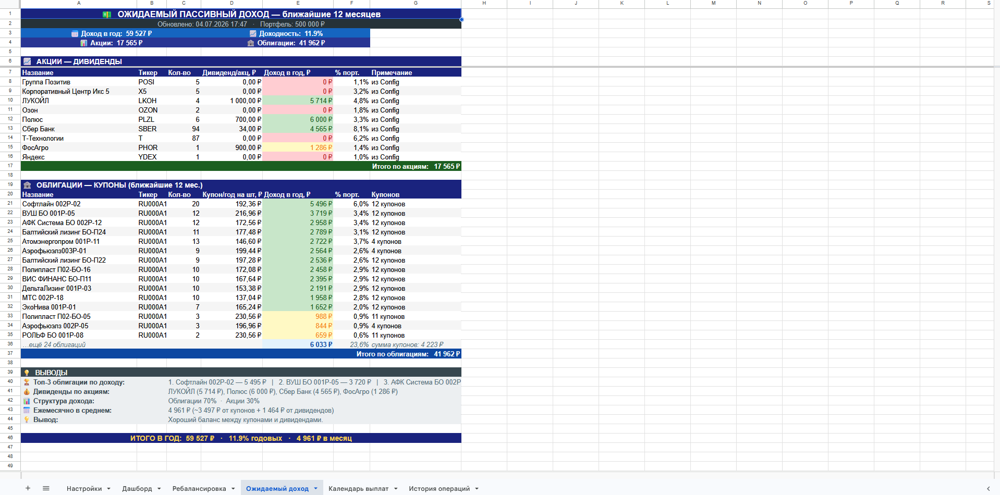
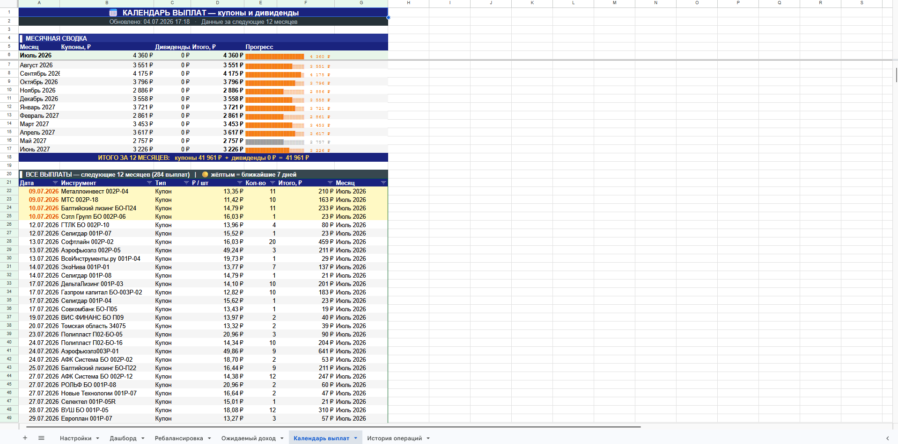
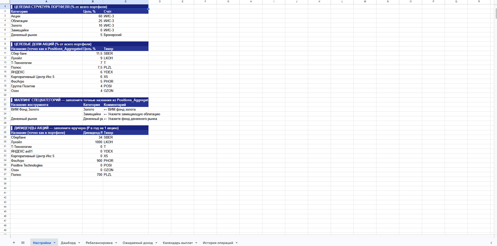
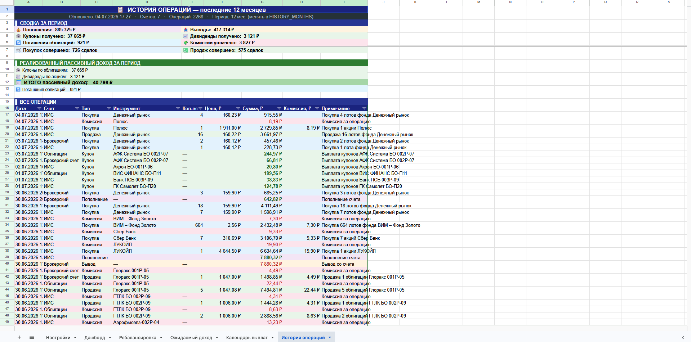

# 📊 T-Invest Portfolio Tracker

> **Умная ребалансировка с учётом лотов. Реализованный пассивный доход. Полноценная история и календарь выплат — всё в одной таблице.**

Работает прямо в **Google Sheets** и синхронизируется через **T-Invest API**: одного токена с правами на чтение достаточно, чтобы подтянуть **ИИС-3** и любые другие счета Т-Банка одновременно.

---

## 🖼 Скриншоты

**Дашборд** — распределение портфеля, диаграммы, прогресс к цели по каждой бумаге


**Ребалансировка** — калькулятор пополнения с умным распределением по лотам


**Ожидаемый доход** — купоны и дивиденды на ближайшие 12 месяцев


**Календарь выплат** — точные даты и суммы по месяцам


**Настройки** — целевая структура портфеля


**История операций** — все сделки за 12 месяцев и реализованный пассивный доход


---

## ✨ Возможности

### 💰 Умная ребалансировка с учётом лотов
Алгоритм распределяет бюджет пропорционально дефициту каждой позиции, округляет до целых лотов и отдаёт остаток самым отстающим бумагам — пока каждый рубль не найдёт своё место. Кнопка «Пропустить» исключает любую бумагу из расчёта одним кликом.

### 🏦 Честный учёт пассивного дохода
Купоны и дивиденды считаются отдельно от возврата номинала при погашении облигаций — так цифра «пассивный доход» отражает реальный заработок, а не движение капитала. Дивиденды вычисляются на основе истории выплат из API с привязкой к типичному месяцу выплаты.

### 📅 Точный календарь купонных выплат
Расписание купонов подтягивается через `GetBondCoupons` с точными датами — не приблизительные годовые суммы, а конкретные выплаты по конкретным датам. Ближайшие 7 дней выделяются жёлтым.

### 📋 Полноценная история операций
Все операции за 12 месяцев загружаются через `GetOperationsByCursor` с поддержкой пагинации — до 1000 записей за запрос. Автоматически показывает сводку: пополнения, выводы, комиссии и пассивный доход за период.

### 🔗 Все счета в одном месте
ИИС-3, брокерские и любые другие открытые счета в Т-Банке подтягиваются автоматически — достаточно одного токена с правами на чтение.

### ⚡ Полностью автоматический
Триггер Google Apps Script обновляет все данные раз в час без участия пользователя. Технические листы скрываются автоматически после каждой синхронизации.

---

## 🔄 Как это работает

```
T-Invest API
    │
    ├── GetAccounts        → список всех открытых счетов
    ├── GetPortfolio       → позиции по каждому счёту
    ├── GetBondCoupons     → расписание купонных выплат
    ├── GetDividends       → история дивидендных выплат
    └── GetOperationsByCursor → история операций (с пагинацией)
              │
              ▼
    Google Sheets (технические листы)
    Позиции / Дан_Акции / Дан_Облигации / ...
              │
              ▼
    Пользовательские листы
    Дашборд / Ребалансировка / Ожидаемый доход / Календарь / История
```

Все технические листы скрываются автоматически — пользователь видит только 6 рабочих листов.

---

## 📋 Требования

- Аккаунт **Google** (Google Sheets + Google Apps Script)
- Счёт в **Т-Банке** (ИИС-3 или брокерский)
- Токен **T-Invest API** с правами на чтение

---

## ⚙️ Установка

### Шаг 1 — Создание таблицы

1. Откройте [Google Sheets](https://sheets.google.com) → создайте новую таблицу
2. Перейдите в **Расширения → Apps Script**

### Шаг 2 — Добавление файлов

Все скрипты лежат в папке [`Code/`](Code/). Для каждого файла оттуда создайте отдельный скрипт в Apps Script (само название папки на структуру внутри Apps Script не влияет — там всё равно единый плоский список файлов):

| Файл | Назначение |
|---|---|
| `Code/tinvest.js` | Ядро: подключение к T-Invest API |
| `Code/dashboard.js` | Главный файл: конфиг, дашборд, ребалансировка |
| `Code/income.js` | Лист «Ожидаемый доход» |
| `Code/calendar.js` | Лист «Календарь выплат» |
| `Code/history.js` | Лист «История операций» |
| `Code/charts.js` | Диаграммы на Дашборде |

### Шаг 3 — Токен API

1. В Т-Банке: **Инвестиции → Настройки → Токен для OpenAPI**
2. Выпустите токен с правами **«Только чтение»**
3. В Apps Script: **⚙️ Настройки проекта → Свойства скрипта → Добавить свойство**:
   - Имя: `TINKOFF_TOKEN`
   - Значение: ваш токен

### Шаг 4 — Первоначальная настройка

Обновите страницу таблицы — появится меню **Tinkoff**. Запустите:

```
Tinkoff → ⚙️ Инициализировать Config (первый запуск)
Tinkoff → 🚀 Синхронизировать + обновить всё
```

### Шаг 5 — Автообновление

Apps Script → **Триггеры (⏱) → + Добавить триггер**:

| Поле | Значение |
|---|---|
| Функция | `syncAndRefresh` |
| Источник | Время |
| Тип | Таймер по часам |
| Интервал | Каждый час |

---

## 🗂 Настройка стратегии

Откройте лист **Настройки** и заполните четыре блока:

**Блок 1 — Целевое распределение по классам:**
```
Акции:           60%
Облигации:       25%
Золото:          10%
Замещайки:        0%
Денежный рынок:   5%
```

**Блок 2 — Целевые доли акций** (% от всего портфеля):
```
Сбер Банк:       11.5%
ЛУКОЙЛ:             9%
Полюс:            7.5%
Т-Технологии:       7%
Корпоративный Центр Икс 5: 6%
Яндекс:             6%
ФосАгро:            5%
Группа Позитив:     4%
Озон:               4%
```

**Блок 3 — Маппинг спецкатегорий** (укажите точные названия из листа «Позиции»):
```
ВИМ Фонд Золото  →  Золото
Денежный рынок   →  Денежный рынок
```

**Блок 4 — Дивиденды акций** (добавляется автоматически при инициализации):
```
Сбер Банк:    34 ₽/акция в год
Лукойл:     1000 ₽/акция в год
```

---

## 📁 Структура файлов

```
Code/
├── tinvest.js     — T-Invest API: авторизация, синхронизация, кэш справочника
├── dashboard.js   — DST-константы, конфиг, дашборд, ребалансировка с лотами
├── income.js      — ожидаемый доход: купоны через API + дивиденды из конфига
├── calendar.js    — календарь: точные даты выплат, месячная сводка
├── history.js     — история: GetOperationsByCursor, пагинация, пассивный доход
└── charts.js      — диаграммы: круговая и столбчатая для дашборда
```

---

## 💡 Использование

### Ребалансировка при пополнении

1. Откройте лист **Ребалансировка**
2. Введите сумму пополнения в жёлтую ячейку **B2**
3. `Tinkoff → 💰 Пересчитать калькулятор пополнения`
4. Таблица покажет сколько лотов каждой бумаги купить
5. Поставьте галочку «Пропустить» если бумага сейчас неудобна — остаток перераспределится

### Годовая ребалансировка

Раз в год смотрите на **Дашборд** — красный цвет означает отклонение от цели более 3 пп.

---

## 🔧 Кастомизация

| Параметр | Файл | Константа |
|---|---|---|
| Глубина истории | `Code/history.js` | `HISTORY_MONTHS = 12` |
| Топ-N облигаций в доходе | `Code/income.js` | `BOND_TOP_N = 15` |
| Пороги цветовой подсветки | `Code/dashboard.js` | `THR = { OK: 1.5, WARN: 3.0 }` |

---

## ⚠️ Важные замечания

- Инструмент работает **только на чтение** — никаких автоматических сделок
- Данные обновляются с задержкой до 1 часа
- Будущие дивиденды вносятся вручную (API их не публикует заранее)
- Купонные выплаты рассчитываются на основе расписания из API и могут незначительно отличаться от фактических

---

## 🗺 Что дальше

- [ ] **Yield on Cost** (в приоритете) — доходность от цены покупки, а не от текущей рыночной. Показывает, сколько реально приносит портфель относительно вложенных денег, а не просто текущую дивдоходность рынка
- [ ] **Ребалансировка облигаций** — конкретные бумаги для докупки, а не только суммы по категории
- [ ] Поддержка нескольких инвестиционных профилей в одной таблице

---

## 📄 Лицензия и вклад в проект

Проект распространяется по лицензии **MIT** — используйте свободно, адаптируйте под свою стратегию и счета.

Нашли баг, придумали улучшение или просто хотите обсудить идею — открывайте Issue или Pull Request, буду рад любой обратной связи.

Построен на базе [T-Invest API](https://developer.tbank.ru/invest/intro) и Google Apps Script.

---

## ❤️ Поддержать автора

Если инструмент или другие мои проекты на GitHub помогли тебе — можешь поддержать разработку.

**CloudTips** — https://pay.cloudtips.ru/p/2ed6c66f

Спасибо большое!