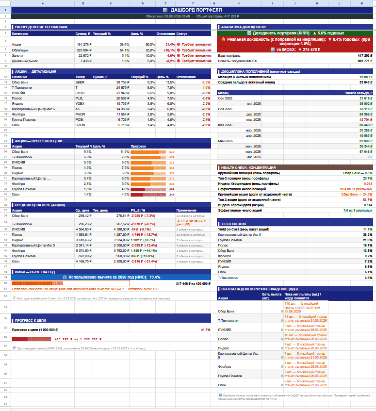
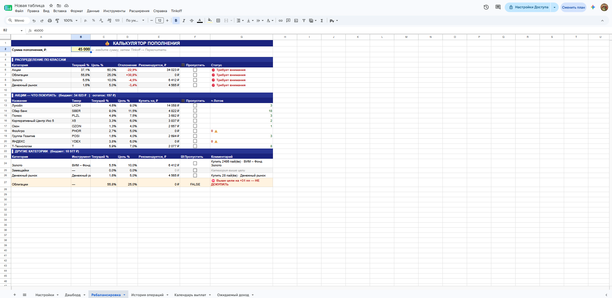
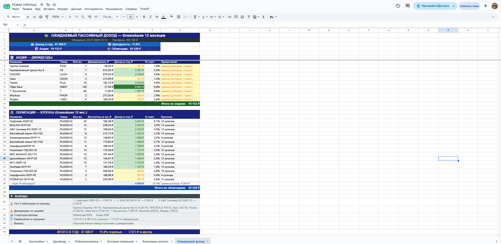
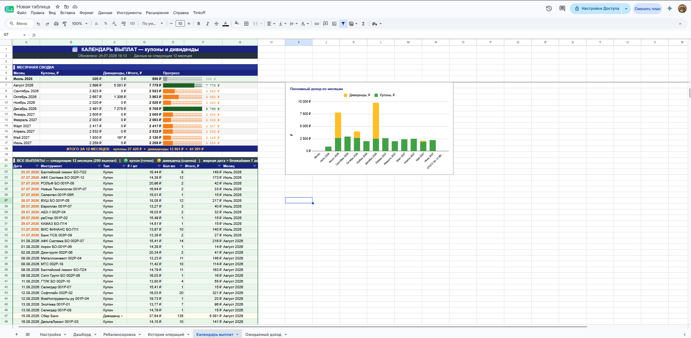
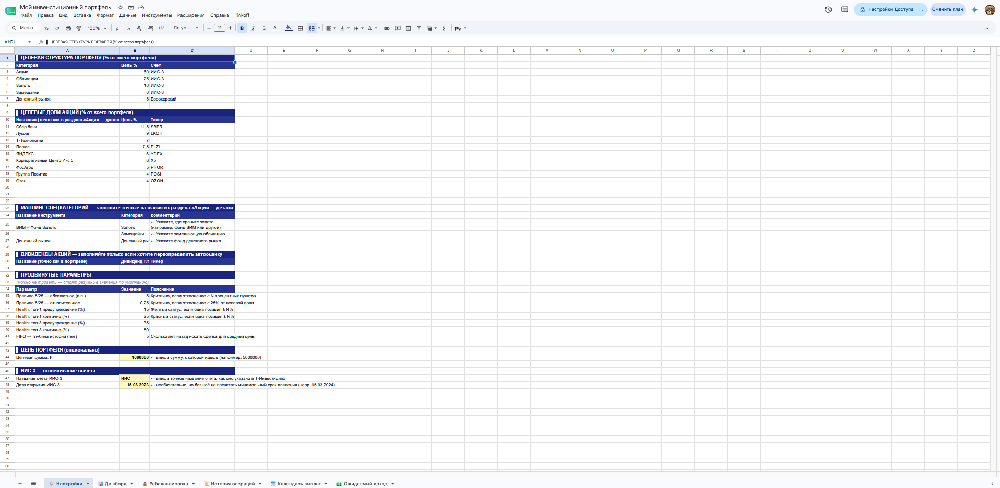
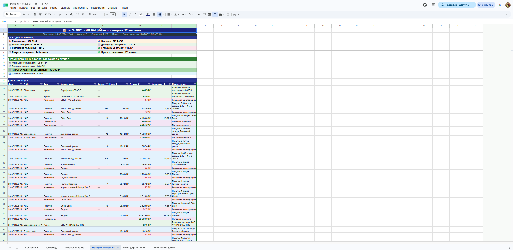

# 📊 T-Invest Portfolio Tracker

> **Умная ребалансировка с учётом лотов. Реализованный пассивный доход. Полноценная история, календарь выплат, health-check и XIRR — всё в одной таблице.**

Работает прямо в **Google Sheets** и синхронизируется через **T-Invest API**: одного токена с правами на чтение достаточно, чтобы подтянуть **ИИС-3** и любые другие счета Т-Банка одновременно.

---

## 🖼 Скриншоты

**Дашборд** — распределение портфеля, диаграммы, прогресс к цели, аналитика доходности, health-check


**Ребалансировка** — калькулятор пополнения с умным распределением по лотам


**Ожидаемый доход** — купоны и дивиденды на ближайшие 12 месяцев


**Календарь выплат** — точные даты и суммы по месяцам


**Настройки** — целевая структура портфеля и вся стратегия


**История операций** — все сделки за 12 месяцев и реализованный пассивный доход


📖 Полный пошаговый гайд по установке (39 скриншотов, от пустой таблицы до первого отчёта) — в [`INSTALLATION.md`](INSTALLATION.md).

---

## ✨ Возможности

### 💰 Умная ребалансировка с учётом лотов
Алгоритм распределяет бюджет пропорционально дефициту каждой позиции, округляет до целых лотов и отдаёт остаток самым отстающим бумагам — пока каждый рубль не найдёт своё место. Кнопка «Пропустить» исключает любую бумагу из расчёта одним кликом.

### 🏦 Честный учёт пассивного дохода
Купоны и дивиденды считаются отдельно от возврата номинала при погашении облигаций. Дивиденды вычисляются автоматически на основе истории выплат из API (`GetDividends`), с возможностью переопределить конкретную бумагу вручную в Config.

### 📅 Точный календарь купонных выплат
Расписание купонов подтягивается через `GetBondCoupons` с точными датами — не приблизительные годовые суммы, а конкретные выплаты по конкретным датам. Ближайшие 7 дней выделяются жёлтым.

### 📋 Полноценная история операций
Все операции за 12 месяцев загружаются через `GetOperationsByCursor` с поддержкой пагинации. Автоматически показывает сводку: пополнения, выводы, комиссии и реализованный пассивный доход за период.

### 📈 XIRR и сравнение с IMOEX
Доходность считается с учётом реальных дат и сумм пополнений (XIRR), плюс честное сравнение — сколько было бы, если бы все эти деньги вместо портфеля пошли в индекс IMOEX.

### 🩺 Health-check концентрации
Показывает долю крупнейшей позиции и топ-3 позиций — отдельно по всему портфелю и отдельно по акционной части, с настраиваемыми порогами предупреждения/критичности.

### 🏦 Дисциплина пополнений
Месячное сальдо пополнений за последние 12 месяцев — сколько месяцев подряд был чистый приток денег, а не просто «докупил на сдачу».

### 🎯 Прогресс к цели и ИИС-3
Отдельные блоки: прогресс к заданной целевой сумме портфеля и отслеживание использования годового лимита налогового вычета по ИИС-3.

### 📄 Годовой отчёт и HTML-дашборд одной кнопкой
Полноценный Google-документ с итогами за год (доходность, дисциплина, концентрация, структура) — и интерактивный HTML-дашборд с карточками и графиками Chart.js, открывающийся прямо в таблице.

### 🔗 Все счета в одном месте
ИИС-3, брокерские и любые другие открытые счета в Т-Банке подтягиваются автоматически — достаточно одного токена с правами на чтение.

### ⚡ Полностью автоматический
Два триггера Google Apps Script: полная синхронизация и обновление всех листов раз в сутки, плюс ежедневный снимок баланса для графика роста портфеля во времени. Технические листы скрываются автоматически после каждой синхронизации.

---

## 🔄 Как это работает

```
T-Invest API
    │
    ├── GetAccounts            → список всех открытых счетов
    ├── GetPortfolio           → позиции по каждому счёту
    ├── GetBondCoupons         → расписание купонных выплат
    ├── GetDividends           → история дивидендных выплат
    ├── GetCandles (IMOEX)     → сравнение доходности с индексом
    └── GetOperationsByCursor  → история операций (с пагинацией)
              │
              ▼
    Google Sheets (технические листы, скрыты)
    _Позиции / _Дан_Акции / _Дан_Облигации / _Дан_Фонды / _Дан_Валюта / ...
              │
              ▼
    Пользовательские листы
    Настройки / Дашборд / Ребалансировка / Ожидаемый доход /
    Календарь выплат / История операций
```

Все технические листы скрываются автоматически — пользователь видит только 6 рабочих листов.

---

## ❓ Часто задаваемые вопросы

### ❓ Зачем это, если есть `=GOOGLEFINANCE()`?
`GOOGLEFINANCE` плохо дружит с Мосбиржей: часто не знает конкретные фонды, не тянет цену облигаций и вообще не видит ваши сделки и историю операций. Трекер работает через официальный T-Invest API, поэтому видит именно ваш портфель — включая все счета, лоты и реальную историю, а не только рыночную цену тикера.

### ❓ Насколько это безопасно — отдавать токен от брокерского счёта скрипту?
Используется токен с правами **только на чтение** — скрипт физически не может отправить ни одной заявки на покупку/продажу. Код выполняется в вашем собственном Google Apps Script, данные хранятся в вашей же Google Таблице — никуда на сторонние серверы ничего не уходит.

### ❓ Чем ребалансировка здесь отличается от «просто посчитать проценты»?
Учитывает лотность: не просто говорит «нужно купить на 14 000 ₽», а сколько именно целых лотов купить, и куда пристроить остаток, который не делится ровно. Плюс можно исключить любую бумагу чекбоксом «Пропустить», и остаток бюджета честно перераспределится на остальные.

### ❓ Как трекер понимает, что фонд денежного рынка или золото — не просто «ещё одна бумага»?
Через блок «Маппинг спецкатегорий» в Config — вы один раз указываете, какой конкретно инструмент в вашем портфеле считать золотом, а какой — денежным рынком (по точному названию), и дальше трекер сам относит его к нужной категории при каждой синхронизации.

### ❓ Что такое health-check концентрации и зачем он нужен?
Показывает долю крупнейшей позиции и топ-3 позиций — отдельно по всему портфелю и по акциям. Если одна бумага незаметно выросла до трети портфеля, вы узнаете об этом с дашборда, а не постфактум после просадки.

### ❓ Отслеживается ли лимит вычета по ИИС-3?
Да — отдельный блок показывает, сколько из годового лимита в 400 000 ₽ уже выбрано пополнениями, чтобы не потерять часть налогового вычета к концу года.

### ❓ Как трекер учитывает золото, замещающие облигации и фонды денежного рынка (LQDT и аналоги)?
API не всегда однозначно относит такие инструменты к понятной категории. Блок «Маппинг спецкатегорий» в Config позволяет один раз вручную связать точное название инструмента (например, конкретный БПИФ золота или фонд денежного рынка) с нужным классом активов — дальше трекер сам подставляет его в правильную категорию при каждой синхронизации.

### ❓ В чём отличие от платных сервисов вроде Snowball или Intelinvest?
Данные и токен «только на чтение» находятся исключительно в вашем личном Google Drive — ничего не передаётся на сторонний сервер. При этом бесплатно доступны продвинутые метрики: XIRR, сравнение с IMOEX, health-check концентрации, учёт лотности при ребалансировке и годовой отчёт одной кнопкой. Из минусов — установка требует один раз вручную перенести код в Apps Script (см. `INSTALLATION.md`), готовый сервис в этом смысле удобнее из коробки.

---

## 📋 Требования

- Аккаунт **Google** (Google Sheets + Google Apps Script)
- Счёт в **Т-Банке** (ИИС-3 или брокерский)
- Токен **T-Invest API** с правами на чтение

---

## ⚙️ Установка

Короткая версия — подробная, со всеми 39 скриншотами, в [`INSTALLATION.md`](INSTALLATION.md).

1. Создайте новую **Google Таблицу** → **Расширения → Apps Script**.
2. Для каждого файла из папки [`Code/`](Code/) создайте отдельный файл в Apps Script с тем же именем (без расширения `.js`) и вставьте его код — см. полный список файлов ниже.
3. В Т-Банке выпустите токен **T-Invest API** с правами **«Только чтение»**: Инвестиции → Настройки → Токен для OpenAPI.
4. В Apps Script: **⚙️ Настройки проекта → Свойства скрипта → Добавить свойство**: имя `TINKOFF_TOKEN`, значение — ваш токен.
5. Добавьте два триггера (**⏱ Триггеры → + Добавить триггер**):

   | Функция | Источник | Тип | Время |
   |---|---|---|---|
   | `syncAndRefresh` | Время | По дням | любое удобное окно, например 23:00–0:00 |
   | `recordDailySnapshot` | Время | По дням | то же окно |

6. Обновите страницу таблицы — появится меню **Tinkoff**. Запустите:

   ```
   Tinkoff → ⚙️ Настройки → Инициализировать Config   (первый запуск)
   Tinkoff → 🚀 Синхронизировать + обновить всё
   ```

---

## 🗂 Настройка стратегии

Откройте лист **Настройки** и заполните блоки Config.

**Блок 1 — Целевая структура портфеля** (% от всего портфеля):
```
Акции:            60%
Облигации:        25%
Золото:           10%
Замещайки:         0%
Денежный рынок:    5%
```

**Блок 2 — Целевые доли акций** (% от всего портфеля; название — точно как в листе `_Дан_Акции`):
```
Сбер банк:                  11.5%
Лукойл:                        9%
Т-Технологии:                  7%
Полюс:                       7.5%
ЯНДЕКС:                        6%
Корпоративный Центр Икс 5:     6%
ФосАгро:                       5%
Группа Позитив:                4%
Озон:                          4%
```

**Блок 3 — Маппинг спецкатегорий** (точное название инструмента — из `_Дан_Фонды` / `_Дан_Облигации`):
```
ВИМ – Фонд Золото   →   Золото
Денежный рынок      →   Денежный рынок
```
Заполняется только для золота, замещающих облигаций и денежного рынка — их сложно определить автоматически по типу инструмента.

**Блок 4 — Дивиденды акций** *(опционально)*. По умолчанию дивиденды считаются автоматически из истории API — этот блок нужен, только если хотите переопределить конкретную бумагу вручную:
```
Сбер банк:    34 ₽/акция в год
```

**Блок 5 — Продвинутые параметры** *(можно не трогать — стоят разумные значения по умолчанию)*: пороги правила 5/25, пороги health-check концентрации, глубина истории для расчёта средней цены (FIFO).

**Блок 6 — Цель портфеля** *(опционально)*: целевая сумма в рублях для блока «Прогресс к цели» на Дашборде.

---

## 📁 Структура файлов

```
Code/
├── tinvest.js       — T-Invest API: авторизация, синхронизация, кэш справочника инструментов
├── dashboard.js      — DST-константы, Config, Дашборд, ребалансировка с лотами, меню Tinkoff
├── income.js         — «Ожидаемый доход»: купоны через API + дивиденды (авто + ручной override)
├── calendar.js        — «Календарь выплат»: точные даты купонов, оценка дат дивидендов
├── history.js         — «История операций»: GetOperationsByCursor, пагинация, сводка периода
├── charts.js          — диаграммы на Дашборде: круговая, столбчатая, прогресс по акциям
├── advparams.js       — продвинутые параметры (пороги 5/25, health-check, глубина FIFO) из Config
├── avgprice.js        — средняя цена по FIFO и P/L по акциям
├── benchmark.js       — сравнение доходности портфеля с IMOEX + расчёт XIRR
├── xirr.js            — расчёт XIRR (доходность с учётом дат и сумм пополнений)
├── discipline.js      — дисциплина пополнений: месячное сальдо за 12 месяцев
├── goal.js            — прогресс к целевой сумме портфеля
├── health.js           — health-check концентрации (топ-1 / топ-3 позиции)
├── iis.js              — ИИС-3: использование годового лимита налогового вычета
├── yieldoncost.js       — Yield on Cost (доход к себестоимости, а не к текущей цене)
├── snapshot.js          — ежедневный снимок баланса с разбивкой по категориям
├── htmldashboard.js      — интерактивный HTML-дашборд (карточки + графики Chart.js)
├── report.js             — годовой отчёт одной кнопкой (Google Doc)
├── sections.js           — общий механизм секций на листе «Дашборд»
└── lock.js               — защита тяжёлых функций от параллельного запуска
```

---

## 💡 Использование

### Ребалансировка при пополнении

1. Откройте лист **Ребалансировка**
2. Введите сумму пополнения в жёлтую ячейку **B2**
3. `Tinkoff → 📊 Дашборд и ребаланс → Пересчитать калькулятор пополнения`
4. Таблица покажет, сколько лотов каждой бумаги купить
5. Поставьте галочку «Пропустить», если бумага сейчас неудобна — остаток перераспределится

### Регулярная проверка

Раз в неделю-две смотрите на **Дашборд** — красный статус означает отклонение от цели по правилу 5/25. Там же — XIRR, сравнение с IMOEX, health-check концентрации и дисциплина пополнений.

### Годовой отчёт

`Tinkoff → 📄 Отчёты → Сформировать годовой отчёт` — за секунды соберёт Google-документ с итогами года: доходность, структура портфеля, дисциплина, концентрация, статистика операций.

---

## 🔧 Кастомизация

| Параметр | Файл | Константа |
|---|---|---|
| Топ-N облигаций в «Ожидаемом доходе» | `income.js` | `BOND_TOP_N = 15` |
| Пороги 5/25, health-check, глубина FIFO | `advparams.js` | `ADV_PARAMS_DEFAULTS_` *(лучше менять прямо в Config, блок 5)* |
| Глубина «Дисциплины пополнений» | `discipline.js` | `DISCIPLINE_MONTHS_BACK = 12` |
| Лимит вычета ИИС-3 | `iis.js` | `IIS_DEDUCTION_LIMIT = 400000` |
| Глубина расчёта XIRR | `xirr.js` | `XIRR_YEARS_BACK = 5` |
| Глубина сравнения с IMOEX | `benchmark.js` | `BENCH_YEARS_BACK = 5` |

---

## ⚠️ Важные замечания

- Инструмент работает **только на чтение** — никаких автоматических сделок
- Данные обновляются по расписанию триггеров (по умолчанию — раз в сутки)
- Будущие дивиденды по новым бумагам без истории выплат вносятся вручную (API не публикует их заранее)
- Купонные выплаты рассчитываются на основе расписания из API и могут незначительно отличаться от фактических

---

## 🗺 Планы

Не реализовано, но в проработке:

- **Уведомления в Telegram** — о ближайших купонных/дивидендных выплатах, отклонениях от целевых долей по правилу 5/25 и завершении ежедневной синхронизации. Архитектура — децентрализованная: каждый пользователь заводит и хостит своего собственного бота, без общего сервера

---

## 📄 Лицензия и вклад в проект

Проект распространяется по лицензии **MIT + Commons Clause**: свободно копируйте, меняйте и используйте код для себя. Единственное ограничение — нельзя продавать сам код или зарабатывать на нём как на платном продукте/сервисе без согласования с автором. Если хотите использовать трекер в коммерческом продукте — напишите, обсудим условия.

Нашли баг, придумали улучшение или просто хотите обсудить идею — открывайте Issue или Pull Request, буду рад любой обратной связи.

Построен на базе [T-Invest API](https://developer.tbank.ru/invest/intro) и Google Apps Script.

---

## ❤️ Поддержать автора

Если инструмент или другие мои проекты на GitHub помогли тебе — можешь поддержать разработку.

**CloudTips** — https://pay.cloudtips.ru/p/2ed6c66f

Спасибо большое!
